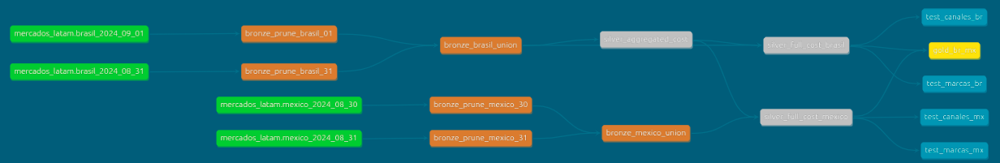

# Data Engineering Challenge DBT pipol

---

# Setup

Para levantar el entorno hay que ejecutar:

* docker-compose up -d

El mismo consiste en 2 containers: uno posee una base en postgres, que será la fuente a la que se conectará dbt. El otro container será el container operativo donde DBT ejecutará.

Una vez hecho esto, habrá que entrar al container de DBT con el comando:

* docker exec -it dbt bash  

Luego, entrar al proyecto con:

* cd challenge

Luego, comenzar el proyecto con:

* dbt init

Acto seguido, completar con estos datos:

+ host: postgres
+ port: 5432
+ user: pipol
+ pass: S3cret
+ db: mercados_latam
+ schema: public

Acto seguido, deployar todos los modelos y tests con:

* dbt build

Por último, para ver la documentación y el linaje, ejecutar:

* dbt docs generate
* dbt docs serve

Entrando a localhost 8080 verás la documentación y el linaje del proyecto

# Estructura

Se pedía generar un datamart que pudiese usar la gerencia, conservando atributos en común entre datasets pertecientes a 2 países distintos: México y Brasil. En este dataset, todos los registros deberían tener un costo asociado en dólares y se debería discriminar a los anuncios entre Primetime, Greytime y Daytime. En caso de que los anuncios no tuvieran un costo asociado, dado su segmento horario, había que estimarlo (usar el promedio).
Se pedían también diccionarios de datos para las marcas y los canales.
Por último, se pedía contemplar que ciertos registros pueden ser eliminados de un día para otro.

Se decidió por usar una estructura Medallion: 

+ **En la capa bronce:** nos quedamos con los atributos en común, unificamos tipos de datos y creamos atributos derivados sencillos. También nos ocupamos de que la información sea la más actualizada posible.

+ **En la capa silver:** se implementa inteligencia de negocio: se maneja la cuestión de los costos, así como la de los diccionarios de datos.

+ **En la capa gold:** se crea el datamart final para la gerencia.

Los significados de los atributos se documentaron en el archivo "source.yaml". El significado de los models, así como el significado de ciertos atributos, fueron documentados en el archivo "schema.yaml". Se crearon tests para evitar nombres erróneos en marcas y canales. 

# Desafíos y comentarios

+ Los datasets crudos diferían en cuestiones clave, a saber, tenían distintos formatos de fecha y los datasets mexicanos no poseían información sobre costos.

+ La lógica del diccionario de datos: apoyarse en los tests personalizados y en la capa silver. Tanto en los tests como en la capa silver (`case when`) el analista deberá ir anotando los nombres incorrectos que encuentre.

+ Más que el promedio por segmento horario usé la mediana. Había un anuncio outlier que salía 57K dolars... ese outlier podía distorsionar mucho el precio promedio.

# Imágenes

Así queda el linaje final del proyecto
